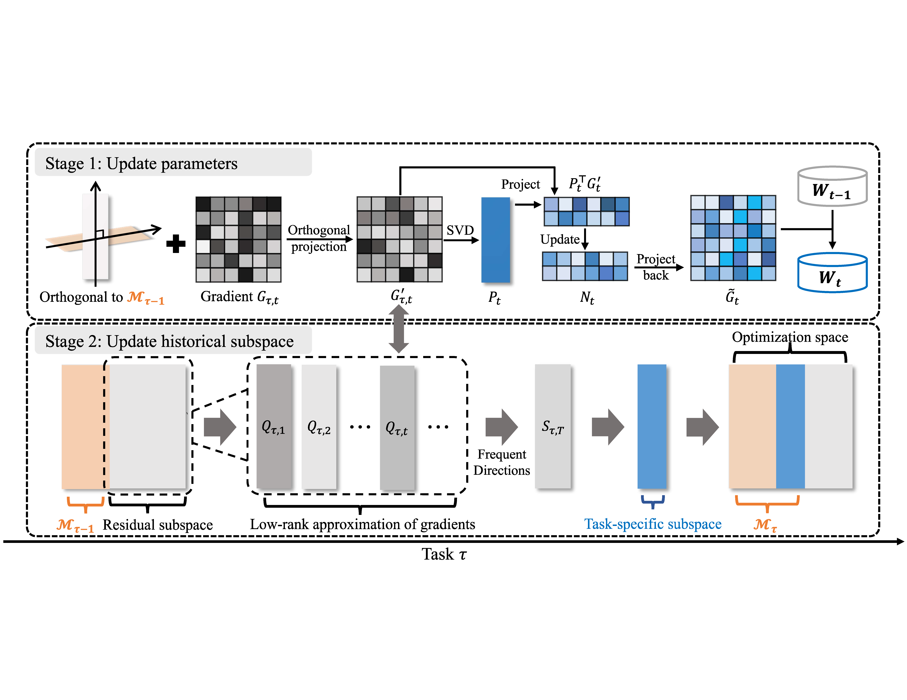

[](https://arxiv.org/abs/2505.11816)
[](https://arxiv.org/abs/2505.11816)
[](https://pytorch.org/)
[](https://github.com/huggingface/pytorch-image-models)


# CoSO: Continuous Subspace Optimization for Continual Learning

This repository contains the official implementation of **CoSO**, introduced in **[Continuous Subspace Optimization for Continual Learning](https://arxiv.org/abs/2505.11816)**.

**Strong performance in pre-trained continual learning:**  

CoSO is a parameter-efficient continual learning method designed for pre-trained vision transformers.  Instead of restricting optimization to a single fixed low-rank subspace, CoSO performs learning in a sequence of dynamically constructed subspaces, which improves adaptation while reducing catastrophic forgetting.

**Memory-efficient optimization:**  

CoSO updates model parameters by projecting gradients onto task-aware subspaces derived from gradient SVD.  It also enforces orthogonality between the current task subspace and historical task subspaces to preserve previously acquired knowledge.

## Method Overview

CoSO constructs optimization subspaces from gradient information and continuously updates them across tasks.  

It projects parameter updates into these subspaces and maintains orthogonality with historical task subspaces to preserve old knowledge.

The key ideas are:

- Build task-specific optimization subspaces from gradient information
- Project updates into these subspaces for efficient adaptation
- Keep the current task subspace orthogonal to historical task subspaces
- Accumulate a historical subspace after each task to mitigate forgetting

This leads to stronger plasticity-stability trade-offs, especially in more difficult incremental settings.



## Usage

### Environment Setup

We recommend using a dedicated conda environment:

```bash
conda create -n cil python=3.10 -y
conda activate cil
pip install torch==2.7.0 torchvision==0.22.0
pip install timm==0.6.12 tqdm numpy pyyaml wandb transformers
```

### Pretrained Weights

Please download the pre-trained ViT backbone checkpoint from the [timm Hugging Face page](https://huggingface.co/timm/vit_base_patch16_224.augreg_in21k_ft_in1k) and place it in the `pretrained/` directory before running the experiments.

Expected directory structure:

```bash
.
├── pretrained/
│   └── vit_base_patch16_224_augreg_in21k_ft_in1k.bin
```

For the default CoSO setting with `vit_base_patch16_224`, the code expects the checkpoint file at:

```bash
./pretrained/vit_base_patch16_224_augreg_in21k_ft_in1k.bin
```

### Dataset Preparation

We provide experiment configs for several continual learning benchmarks. Create a folder `data/`. Please prepare the dataset according to the target config before launching an experiment.

- `cifar100`: automatically downloaded to `./data` by torchvision.
- `ImageNet-R`: download dataset from https://people.eecs.berkeley.edu/~hendrycks/imagenet-r.tar. After unzipping, place it into `data/` folder
- `DomainNet`: download from http://ai.bu.edu/M3SDA/, place it into `data/` folder. The provided `coso_domain` setup uses the split lists in `utils/domainnet_trainb.yaml` and `utils/domainnet_testb.yaml`.

### Run Experiments

All experiments are launched through `main.py` with a JSON config:

```bash
python main.py --config=./exps/{config_name}.json --device 0
```

Examples:

```bash
# CIFAR-100
python main.py --config=./exps/coso_cifar.json --device 0

# ImageNet-R, 5 sessions
python main.py --config=./exps/coso_inr5.json --device 0

# ImageNet-R, 10 sessions
python main.py --config=./exps/coso_inr.json --device 0

# ImageNet-R, 20 sessions
python main.py --config=./exps/coso_inr20.json --device 0

# DomainNet
python main.py --config=./exps/coso_domain.json --device 0
```

Training logs are saved under:

```bash
./logs/{model_name}/{dataset}/{init_cls}/{increment}/
```

## Citation

If you use this repository, please cite the CoSO paper:

```bash
@inproceedings{cheng2025continuous,
  title={Continuous Subspace Optimization for Continual Learning},
  author={Cheng, Quan and Wan, Yuanyu and Wu, Lingyu and Hou, Chenping and Zhang, Lijun},
  booktitle={Advances in Neural Information Processing Systems},
  volume={38},
  year={2025}
}
```

## Contact

For issues related to this implementation, please open an issue in the project repository.

## Paper

- arXiv: [Continuous Subspace Optimization for Continual Learning](https://arxiv.org/abs/2505.11816)
