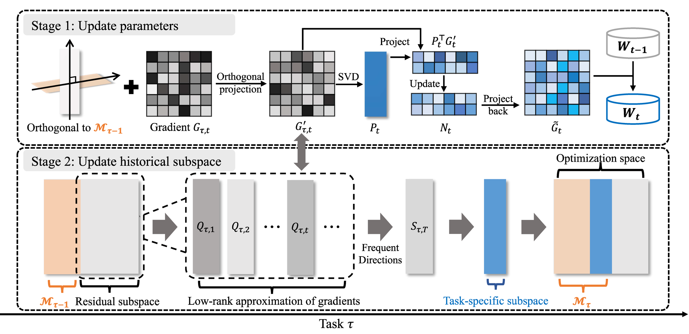
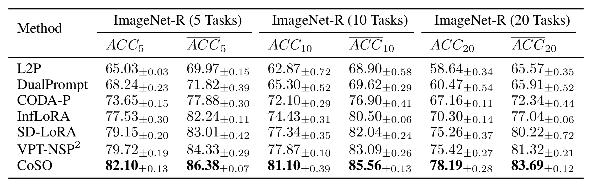
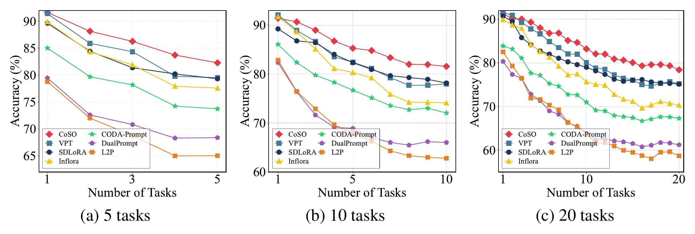

<div align="center">

<h1>CoSO: Continuous Subspace Optimization for Continual Learning</h1>

[](https://proceedings.neurips.cc/paper_files/paper/2025/hash/1663fba7b56da1e96bed6e30546a07b0-Abstract-Conference.html) [](https://www.python.org/) [](https://pytorch.org/) [](https://opensource.org/licenses/MIT)

**[Paper](https://proceedings.neurips.cc/paper_files/paper/2025/hash/1663fba7b56da1e96bed6e30546a07b0-Abstract-Conference.html)** &nbsp;·&nbsp; **[Overview](#overview)** &nbsp;·&nbsp; **[Results](#main-results)** &nbsp;·&nbsp; **[Getting Started](#getting-started)** &nbsp;·&nbsp; **[Citation](#citation)**

</div>

---

> **TL;DR:** CoSO fine-tunes pre-trained models in continuous low-rank subspaces for continual learning.

---

## Overview

Existing parameter-efficient continual learning methods usually rely on low-rank adaptation, which restricts parameter updates to a fixed low-rank subspace and limits their learning capacity. CoSO instead optimizes the model in a series of subspaces derived from the singular value decomposition of the gradients.

<div align="center">

</div>

- **Continuous subspace optimization:** low-rank gradient projections from SVD, refreshed throughout training.
- **Orthogonal projection:** each task's optimization subspace kept orthogonal to the historical task subspace.
- **Historical subspace update:** task-specific subspaces estimated via Frequent Directions and merged after each task.

## Main results

<div align="center">

<br><em>Results (%) on ImageNet-R, mean ± std over 3 runs.</em>
</div>

<div align="center">

<br><em>Accuracy on ImageNet-R with 5, 10 and 20 tasks.</em>
</div>

## Getting started

### 1. Installation

```bash
conda create -n coso python=3.10 -y
conda activate coso
pip install torch==2.7.0 torchvision==0.22.0
pip install timm==0.6.12 tqdm numpy pyyaml wandb transformers
```

The backbone is timm `vit_base_patch16_224`, which timm downloads on the first run.

### 2. Data preparation

Download [ImageNet-R](https://people.eecs.berkeley.edu/~hendrycks/imagenet-r.tar) and [DomainNet](http://ai.bu.edu/M3SDA/), and arrange them under `data/` in the repository root:

```text
data/
├── cifar-100-python/          # downloaded automatically by torchvision
├── imagenet-r/{train,test}/
└── DomainNet/{clipart,infograph,painting,real,sketch}/
```

The DomainNet split is defined in `utils/domainnet_trainb.yaml` and `utils/domainnet_testb.yaml`.

### 3. Usage Example

```bash
python main.py --config ./exps/coso_inr.json --device 0
```

Other settings are in `exps/`: `coso_cifar.json` (CIFAR-100), `coso_inr5.json` / `coso_inr.json` / `coso_inr20.json` (ImageNet-R with 5 / 10 / 20 tasks) and `coso_domain.json` (DomainNet). Logs are saved under `logs/`.

## Citation

If you find our work useful for your research, please star our project and cite our work.

```bibtex
@inproceedings{cheng2025continuous,
  title     = {Continuous Subspace Optimization for Continual Learning},
  author    = {Cheng, Quan and Wan, Yuanyu and Wu, Lingyu and Hou, Chenping and Zhang, Lijun},
  booktitle = {Advances in Neural Information Processing Systems (NeurIPS)},
  volume    = {38},
  pages     = {15376--15398},
  year      = {2025}
}
```

## Acknowledgements

This project builds upon excellent open-source work:

- [GaLore](https://github.com/jiaweizzhao/GaLore)
- [LAMDA-PILOT](https://github.com/sun-hailong/LAMDA-PILOT)


## License

This project is licensed under the [MIT License](https://opensource.org/licenses/MIT).
